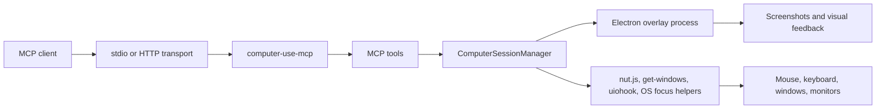

# computer-use-mcp

An MCP server that lets compatible AI clients inspect and control the local desktop through screenshots, mouse input, keyboard input, window focus, and explicit computer-control sessions.

It is similar in spirit to Anthropic's [computer use](https://docs.anthropic.com/en/docs/build-with-claude/computer-use) capability, but packaged as a local Model Context Protocol server.

This project is a fork of the original [`domdomegg/computer-use-mcp`](https://github.com/domdomegg/computer-use-mcp). The fork keeps the same core goal, but focuses on a more controlled MCP contract, explicit desktop-control sessions, richer structured responses, and safer debugging behavior for agent workflows.

## Table of Contents

- [Features](#features)
- [Fork Changes](#fork-changes)
- [How It Works](#how-it-works)
- [Tools](#tools)
- [Prerequisites](#prerequisites)
- [Installation](#installation)
- [Local Development](#local-development)
- [Configuration](#configuration)
- [Usage Examples](#usage-examples)
- [Testing](#testing)
- [Packaging and Release](#packaging-and-release)
- [Troubleshooting](#troubleshooting)
- [Contributing](#contributing)
- [License](#license)

## Features

- Desktop context inspection without starting a control session.
- Explicit session lifecycle before input actions are accepted.
- Multi-monitor screenshots with monitor-local coordinates.
- Ordered batched actions with an implicit 250 ms delay between actions.
- Mouse movement, clicks, drags, scrolling, typing, key shortcuts, screenshots, and sleeps.
- Visible overlay while the agent is controlling the computer.
- Pause behavior when the user manually interacts with the desktop.
- Escape-key and overlay stop controls for ending an active session.
- Structured MCP responses for model-readable state, plus image content only when screenshots or previews are returned.
- Optional file-based debug logging and debug media capture.
- Stdio transport for MCP clients and optional HTTP transport for secured local integrations.

## Fork Changes

Compared with the original upstream project, this fork adds or emphasizes:

- Explicit session control through `computer_toggle_session`, so desktop actions require an active `session_id`.
- Batched `computer_use` calls with an ordered `actions` array, serialized execution, a built-in 250 ms delay between actions, and a real `sleep` action.
- Better model context before acting through `get_context`, including monitors, visible windows, cursor position, current time, timezone, and platform.
- Window focusing through `focus_window`, with platform-specific support for Windows, macOS, and Linux when available.
- Monitor-local coordinate handling, including stable `monitor_id` values and visible application metadata per monitor.
- A visible Electron overlay that shows active/paused state, pauses after manual user input, and can be stopped with Escape or the overlay stop control.
- Structured MCP responses as the primary contract, avoiding decorative plaintext wrappers and returning image content only for screenshots or interaction previews.
- File-based debug logging through `COMPUTER_USE_DEBUG_ENABLED`, with optional debug screenshot/media paths that do not corrupt stdio MCP traffic.
- Optional HTTP transport via `MCP_TRANSPORT=http` for secured local integrations.

## How It Works



The server is a TypeScript Node.js MCP server. The runtime uses:

- `@modelcontextprotocol/sdk` for MCP server and transport support.
- `@nut-tree-fork/nut-js` for mouse, keyboard, and cursor automation.
- `electron` for the transparent desktop overlay and screenshots.
- `get-windows` for visible window discovery.
- `uiohook-napi` for user input and Escape-key monitoring.
- `sharp` for screenshot resizing, preview cropping, and image optimization.
- `express` for the optional streamable HTTP transport.

## Tools

### `get_context`

Inspects desktop state without starting a control session.

Returns structured content with:

- System date, timezone, and platform.
- Cursor position in global and monitor-local coordinates.
- Monitor inventory.
- Visible windows grouped by monitor.

### `focus_window`

Brings a visible desktop window to the foreground by process ID or by a case-insensitive name/title match.

Platform behavior:

- Windows: User32 foreground window activation.
- macOS: System Events process activation.
- Linux: `xdotool` window activation when available.

### `computer_toggle_session`

Starts or ends a computer-control session.

`start` returns:

- `session_id`
- monitor inventory
- visible applications
- overlay/input-monitor status

`end` requires the active `session_id`.

The user can also end a session with Escape or the overlay stop control.

### `computer_use`

Runs an ordered array of desktop actions in an active session.

Top-level input:

```json
{
  "session_id": "session-id-from-computer_toggle_session",
  "actions": []
}
```

Supported actions:

| Action | Required fields | Description |
| --- | --- | --- |
| `get_screenshot` | `monitor_id` | Captures the selected monitor and returns image content plus structured metadata. |
| `mouse_move` | `monitor_id`, `coordinate` | Moves the cursor to monitor-local screenshot coordinates. |
| `left_click` | optional `monitor_id`, optional `coordinate` | Left-clicks at a coordinate or current cursor. |
| `double_click` | optional `monitor_id`, optional `coordinate` | Double-clicks at a coordinate or current cursor. |
| `right_click` | optional `monitor_id`, optional `coordinate` | Right-clicks at a coordinate or current cursor. |
| `middle_click` | optional `monitor_id`, optional `coordinate` | Middle-clicks at a coordinate or current cursor. |
| `left_click_drag` | `monitor_id`, `coordinate` | Drags with the left mouse button from the current cursor to a coordinate. |
| `right_click_drag` | `monitor_id`, `coordinate` | Drags with the right mouse button from the current cursor to a coordinate. |
| `scroll` | `monitor_id`, `coordinate`, `text` | Scrolls from a coordinate. `text` supports `up`, `down`, `left`, `right`, or `direction:amount`. |
| `key` | `text` | Presses a key or key combination. |
| `type` | `text` | Types literal text. |
| `sleep` | `duration_ms` | Waits for 0 to 60000 ms. |

`computer_use` returns structured content with:

- `ok`
- `session_id`
- `action_count`
- `delay_between_actions_ms`
- `steps`
- optional `interaction_preview`

## Prerequisites

- Node.js LTS or newer.
- npm.
- A desktop session with GUI access.
- OS permissions for accessibility, input control, and screen capture where required.
- Linux users should install `xdotool` for best typing and window-focus support.

On macOS, you may need to grant the terminal or AI client Accessibility and Screen Recording permissions.

## Installation

### Claude Code

```bash
claude mcp add --scope user --transport stdio computer-use -- npx -y computer-use-mcp
```

This installs the server at user scope. To install it only for the current directory, omit `--scope user`.

### Claude Desktop

Recommended MCPB installation:

1. Open the latest successful run in the [GitHub Actions history](https://github.com/domdomegg/computer-use-mcp/actions/workflows/ci.yaml?query=branch%3Amaster).
2. Download the `computer-use-mcp-mcpb` artifact.
3. Rename the downloaded `.zip` file to `.mcpb`.
4. Double-click the `.mcpb` file to open it in Claude Desktop.
5. Click **Install**.

Manual JSON configuration:

```json
{
  "mcpServers": {
    "computer-use": {
      "command": "npx",
      "args": ["-y", "computer-use-mcp"]
    }
  }
}
```

### Cursor

One-click install:

[](https://cursor.com/install-mcp?name=computer-use&config=JTdCJTIyY29tbWFuZCUyMiUzQSUyMm5weCUyMC15JTIwY29tcHV0ZXItdXNlLW1jcCUyMiU3RA%3D%3D)

Manual configuration in `~/.cursor/mcp.json` or `.cursor/mcp.json`:

```json
{
  "mcpServers": {
    "computer-use": {
      "command": "npx",
      "args": ["-y", "computer-use-mcp"]
    }
  }
}
```

### Cline

Recommended marketplace installation:

1. Open the **MCP Servers** view in Cline.
2. Search for **Computer Use**.
3. Click **Install** and follow the prompts.

Manual configuration:

```json
{
  "mcpServers": {
    "computer-use": {
      "type": "stdio",
      "command": "npx",
      "args": ["-y", "computer-use-mcp"]
    }
  }
}
```

## Local Development

```bash
git clone https://github.com/domdomegg/computer-use-mcp.git
cd computer-use-mcp
npm install
npm run build
npm start
```

Useful scripts:

| Command | Purpose |
| --- | --- |
| `npm start` | Builds and starts the stdio MCP server. |
| `npm run start:http` | Builds and starts the HTTP MCP endpoint at `/mcp`. |
| `npm run build` | Compiles TypeScript and copies the Electron overlay into `dist`. |
| `npm run lint` | Runs ESLint. |
| `npm test` | Runs the Vitest test suite. |
| `npm run test:watch` | Runs tests in watch mode. |
| `npm run build:mcpb` | Builds the `.mcpb` bundle. |

## Configuration

| Variable | Description | Default |
| --- | --- | --- |
| `MCP_TRANSPORT` | Transport mode. Use `stdio` for MCP clients or `http` for the HTTP endpoint. | `stdio` |
| `PORT` | Port for HTTP transport. | `3000` |
| `COMPUTER_USE_DEBUG_ENABLED` | Enables file-based debug logging when set to `1`. | unset |
| `COMPUTER_USE_DEBUG_LOG_PATH` | Debug log file path. | `debug.log` |
| `COMPUTER_USE_DEBUG_MEDIA_DIR` | Directory for debug screenshots and preview images. | OS temp directory |
| `COMPUTER_USE_DEBUG_RUN_ID` | Run identifier propagated to the overlay process. | generated per process |

HTTP transport has no built-in authentication. Use it only behind a trusted reverse proxy or in a secured local setup.

## Usage Examples

### Start a session

Call `computer_toggle_session`:

```json
{
  "action": "start"
}
```

Use the returned `session_id` and monitor IDs in subsequent calls.

### Capture a screenshot

Call `computer_use`:

```json
{
  "session_id": "session-id",
  "actions": [
    {
      "action": "get_screenshot",
      "monitor_id": "monitor-id"
    }
  ]
}
```

### Click and type

```json
{
  "session_id": "session-id",
  "actions": [
    {
      "action": "left_click",
      "monitor_id": "monitor-id",
      "coordinate": [420, 240]
    },
    {
      "action": "type",
      "text": "Hello from computer-use-mcp"
    }
  ]
}
```

### Wait for UI changes

```json
{
  "session_id": "session-id",
  "actions": [
    {
      "action": "sleep",
      "duration_ms": 1000
    },
    {
      "action": "get_screenshot",
      "monitor_id": "monitor-id"
    }
  ]
}
```

### End a session

```json
{
  "action": "end",
  "session_id": "session-id"
}
```

## Testing

Run the default suite:

```bash
npm test
```

Run linting:

```bash
npm run lint
```

Run a build:

```bash
npm run build
```

The MCPB integration test is gated by `RUN_MCPB_TEST` and expects bundle tooling such as `zip` and `unzip` to be available:

```bash
RUN_MCPB_TEST=1 npm test
```

## Packaging and Release

Build an MCPB package:

```bash
npm run build:mcpb
```

The package script:

1. Builds the project.
2. Writes the current package version into `manifest.json`.
3. Installs production dependencies.
4. Adds cross-platform `sharp` binaries.
5. Creates `computer-use-mcp.mcpb`.
6. Restores the manifest template and full dependency install.

Releases are handled by GitHub Actions on version tags:

1. Bump the version with `npm version major`, `npm version minor`, or `npm version patch`.
2. Push the commit and tag with `git push --follow-tags`.
3. CI publishes to npm, creates a GitHub release with the MCPB file, and publishes metadata to the MCP Registry.

## Troubleshooting

### The model clicks the wrong place

Use `get_screenshot` first and pass coordinates in the selected monitor screenshot coordinate space. Coordinates are local to the screenshot returned for that monitor, not the combined desktop.

### Desktop control does not start

Check OS permissions for screen capture, accessibility, and input monitoring. On Linux, confirm the process has access to the active display session.

### Window focusing does not work on Linux

Install `xdotool` and make sure the `DISPLAY` environment variable points to the active session.

### Debugging is too noisy

Debug logging is disabled by default. When enabled, logs go to a file side channel instead of stdout so MCP stdio traffic stays valid.

```bash
COMPUTER_USE_DEBUG_ENABLED=1 COMPUTER_USE_DEBUG_LOG_PATH=debug.log npm start
```

## Contributing

Pull requests are welcome.

1. Install Git and Node.js.
2. Clone the repository.
3. Install dependencies with `npm install`.
4. Make a focused change.
5. Run `npm run lint`, `npm test`, and `npm run build`.
6. Open a pull request.

## License

MIT. See [LICENSE](LICENSE).
